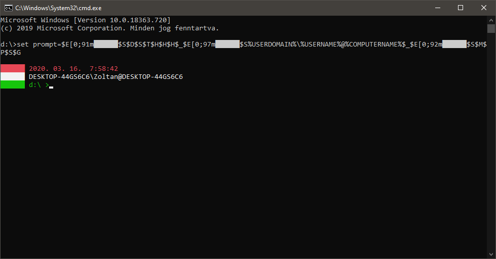

set prompt=$E[0;91m██████$S$D$S$T$H$H$H$_$E[0;97m██████$S%USERDOMAIN%\%USERNAME%@%COMPUTERNAME%$_$E[0;92m██████$S$M$P$S$G

Ha vágólapon keresztül kimásolod a fenti parancsot és a windows 10-en parancssorba bemásolod (Bal fent katt, Szerkesztés, Beillesztés, Enter), akkor ilyen szép nemzeti színü prompt-ot kapsz... :)

